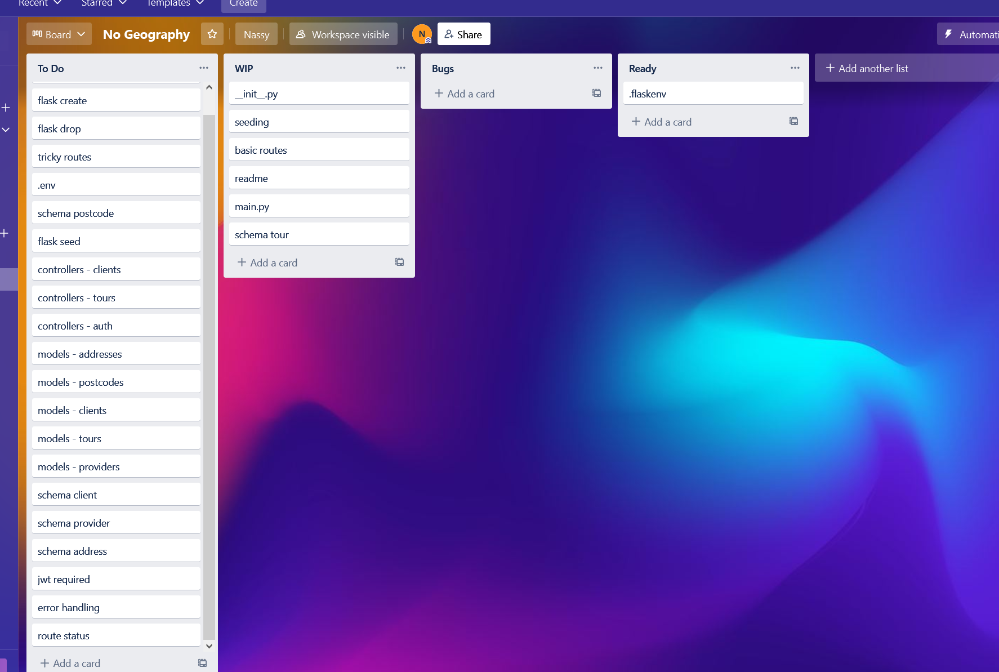

******************NO GEOGRAPHY********************************

A friend of mine is running a travel group on Meetup, they run it by themselves. We were discussing the possibilities of growing the business. One of the idea was about combining different small tour groups similar to what my friend made together. Having all the groups in one place will be beneficial for the group owners - client base will be increasing 
### User story.
    Janice 26
    "My family and I are quite social and active. We like to go for a hike or rent a couple of kayaks and spend exploring a lake, or go for a walk in a forest. It's nice to meet likeminded people and make new friends. I want to have an easy access to the all the activities in my area and easily book something that I like"

Having one database for all the tours created by different groups is beneficial for everyone:
For the business
- Shared client base, works for promo, targeting by location, activity type, etc.
- Easy to be found by people who are already interested in the product

For the client
- One website, one login and password
- Easy search using postcodes
- potentially make a forum/social network, easier to meet with people

For this project we use PostgreSQL database.
Postgres is a very well documented database system, it's open sourced and free. It works well with external databases and runs on different platforms. Nested databases transactions let the database be more adaptable. Creating and dropping the tables is very simple to use.

Some drawback for postgres would be:
- Horizontal scaling can get complicated, requires additional solutions to make it easily useable.
- Not the best solution for large scale applications, it might work noticeably slow.
- According to database structure, we can't have more fields than already had been defined in the database. To change that, we need to go thought the code and implement the change in every place that has a connection.
- Opensource also comes with no warranty and no liability

> ## endpoints
### Authorization routes
- __@auth.route("/register", methods=["POST"])__ 
    - Registration for new clients 
    - Required data: `email`, `password`, `phone`, `first name`, `last name` 
    - Checks for password to be longer than 7 symbols, if not `"password": ["Shorter than minimum length 8."]`, status code 400
    - In case of missing data returns `"email": ["Missing data for required field."]`, status code 400
    - Email and phone are set to be unique, if not unique the errors are `"This email has already been registered"` and `"error": "This phone has already been registered"`, status code 400 
    - Returns email, generated token, first name, last name, status code 201

- __@auth.route("/login", methods=["POST"])__ 
    - Logging in for existing clients.
    - Required data: `email`, `password`
    - Checks for the email to be existed in database, if not found ` "error": "email is not found"`, status code 400
    - Checks for password to match with the one in database, if not `error": "the password is not correct"` or `"password": ["Shorter than minimum length 8."]`, status code 400
    - Returns email and generated token, status code 200 (autogenerated)
- __@auth.route("/admin/login", methods=["POST"])__ 
    - Admin login page.
    - Required data: `email`, `password`.
    - Checks for the email to be existed in database, if not found ` "error": "this email does not have admin rights`, status code 403
    - Checks for password to match with the one in database, if not `error": "the password is not correct"` or `"password": ["Shorter than minimum length 8."]`, status code 400
    - Returns email and generated token, status code 200 (autogenerated)
### Tours routes
- __@tours.route("/", methods=["GET"], strict_slashes=False)__ 
    - Getting all the tours
    - Returns tour details such: title, description, id, date and time, length, cost, capacity, provider name, suburb, postcode and state, status code 200 (autogenerated)
- __@tours.route("/<int:id>", methods=["GET"])__ 
    - Getting information about a tour
    - Required to put a tour id number in the route
    - Returns tour details such: title, description, id, date and time, length, cost, capacity, provider name, suburb, postcode and state, status code 200 (autogenerated)
    - If no tour is found `"error": "no such tour id", status code 404
- __@tours.route("/postcode/<int:postcode>", methods=["GET"])__ 
    - Finding the tours by postcode
    - Required to put a postcode in the route, if not found `"error": "no such postcode"`, status code 404
    - Returns tour details such: title, description, id, date and time, length, cost, capacity, provider name, suburb, postcode and state, status code 200 (autogenerated)
    - If no tour is found `"error": "no tours in this area"`, status code 404
- __@tours.route("/add", methods=["POST"])__ 
    - Adding new tour
    - Required: admin token authorization, if no token `"msg": "Missing Authorization Header"`, status code 401 (autogenerated),  if admin token expired ` "msg": "Token has expired"`, status code 200 (autogenerated), if not admin `"error": "You don't have the permission to do this"`, status code 403
    - Data required: `title`, `description`, `id`, `date`, `cost`, `capacity`, `address_id`, `provider_id`
    - Returns tour details such: title, description, id, date and time, length, cost, capacity, provider name, suburb, postcode and state, status code 201
- __@tours.route("/<int:id>", methods=["PUT"])__ 
    - Update existing tour
    - Required: admin token authorization, if no token `"msg": "Missing Authorization Header"`, status code 401 (autogenerated),  if admin token expired ` "msg": "Token has expired"`, status code 200 (autogenerated), if not admin `"error": "You don't have the permission to do this"`, status code 403
    - Required to put tour id in the route,  if not found `"error": "no such tour id"`, status code 404
    - Data required: `title`, `description`, `id`, `date`, `cost`, `capacity`, `address_id`, `provider_id`
    - Returns tour details such as: title, description, id, date and time, length, cost, capacity, provider name, suburb, postcode and state, status code 201
### Providers routes
- __@providers.route('/', methods=['GET'], strict_slashes=False)__ 
    - Getting all the providers
    - Required: admin token authorization, if no token `"msg": "Missing Authorization Header"`, status code 401 (autogenerated),  if admin token expired ` "msg": "Token has expired"`, status code 200 (autogenerated), if not admin `"error": "You don't have the permission to do this"`, status code 403
    - Returns provider details such as: id, name, website, bank bsb, bank account number, status code 200 (autogenerated) 
- __@providers.route("/<int:id>", methods=['GET'])__ shows 1 provider chosen by id, admin only
    - Getting information about specific provider by id
    - Required: admin token authorization, if no token `"msg": "Missing Authorization Header"`, status code 401 (autogenerated),  if admin token expired ` "msg": "Token has expired"`, status code 200 (autogenerated), if not admin `"error": "You don't have the permission to do this"`, status code 403
    - Required to put provider id in the route,  if not found `"error": "no such provider id"`, status code 404
    - Returns provider details such as: id, name, website, bank bsb, bank account number, status code 200 (autogenerated) 
- __@providers.route("/add", methods=["POST"])__ adding new provider, admin only
    - adding new provider
    - Required: admin token authorization, if no token `"msg": "Missing Authorization Header"`, status code 401 (autogenerated),  if admin token expired ` "msg": "Token has expired"`, status code 200 (autogenerated), if not admin `"error": "You don't have the permission to do this"`, status code 403
    - Required data: `name`, `website`, `bank_bsb`, `bank_acc_number`, `address_id`. Name should be unique, if not `"error": "This provider has already been registered"`, status code 400
    - Returns provider details such as: id, name, website, bank bsb, bank account number, status code 201
### Bookings routes
- __@bookings.route('/', methods=["GET"], strict_slashes=False)__ 
    - Getting all the bookings
    - Required: admin token authorisation, if no token `"msg": "Missing Authorization Header"`, status code 401 (autogenerated),  if admin token expired ` "msg": "Token has expired"`, status code 200 (autogenerated), if not admin `"error": "You don't have the permission to do this"`, status code 403
    - Returns all the bookings with the information: booking id, client id, tour id, client first and last name, tour title, created day and time, status code 200 (autogenerated)
- __@bookings.route("<int:tour_id>/add/<int:client_id>", methods=["POST"])__ 
    - Required: admin token authorization, if no token `"msg": "Missing Authorization Header"`, status code 401 (autogenerated), if admin token expired ` "msg": "Token has expired"`, status code 200 (autogenerated), if not admin `"error": "You don't have the permission to do this"`, status code 403
    - Required to put booking id and client id in the route, if tour id not found ` "error": "Tour id not found in the database"`, status code 404, if client id not found `"error": "Client not found in the database"`, error 404
    - Returns booking details such as: booking id, client id, tour id, client first and last name, tour title, created day and time, status code201

> ## ERD 

> ## any third party services that used
While creating this app we added different packages such as:
- psycopg2 is a popular database adapter for Python for creating connections in Flask
- SQLAlchemy lets connect Flaks and PostgreSQL:
- marshmallow lets serialized the data, converting complex database to and from Python datatypes
- marshmallow-sqlalchemy is an integration marshmallow and SQLAlchemy
- Blueprints lets define some of the properties which it can be used at any time in the app
- flask-bcrypt provide bcrypt hashing - talking a piece of data of any size and converting to a piece of dada with fixed size. Used for passwords and other sensitive data
- flask-jwt-extended allows create different types of tokens that used for validation and security purposes. It also allows to call a special identity for validation purposes

> ## projects models in terms of the relationships they have with each other
### Addresses module
It consists of:
- address_id as a primary key
- street_number
- street_name
- suburb 
- postcode_id as a foreign key

One address has one postcode. 

One address has one tour

One address has one provider

### Admin model
It consists of:
- admin_id as a primary key
- email
- password
- name

### Bookings model
It consists of:
- booking_id as a primary key
- client_id as a foreign key
- tour_id as a foreign key
- created date ad time

One booking has one tour

One booking can have many clients

### Clients model
It consists of:
- client_id as a primary key
- email
- password
- phone
- first name
- last name

One client can have many bookings

### Postcodes model
It consists of:
- postcode_id as a primary key
- postcode
- state
One postcode can have many addresses

### Providers model
It consists of:
- provider_id as a primary key
- name
- website
- bank bsb
- bank account number
- address_id as a foreign key

One provider can have many tours

One provider can have one address

### Tours model
- tour_id as a primary key
- title
- description
- date and time
- length
- cost
- capacity
- address_id as a foreign key
- provider_id as a foreign key

One tour can be in many bookings

One tour can have one provider

One tour has one address

> ## trello board
We used trello board to track the tasks. During the work the number of tasks increased
Beginning of work

In the middle

In the end

